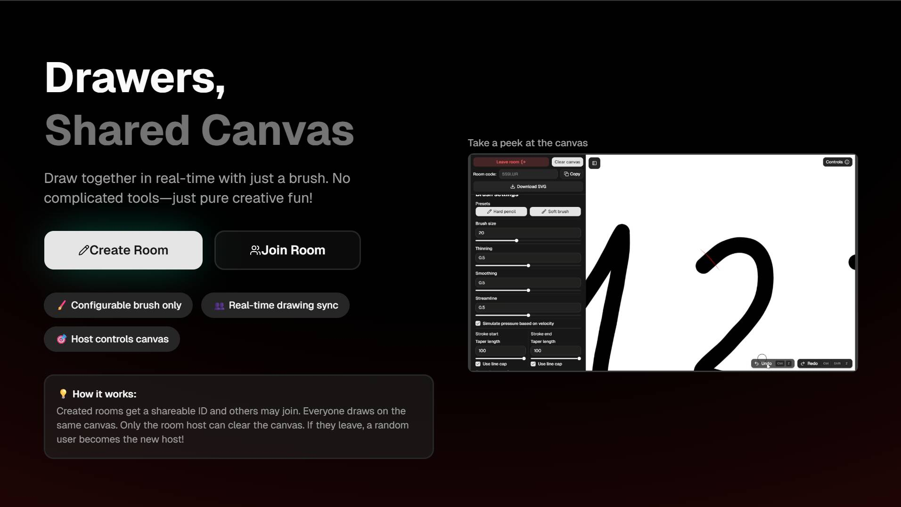
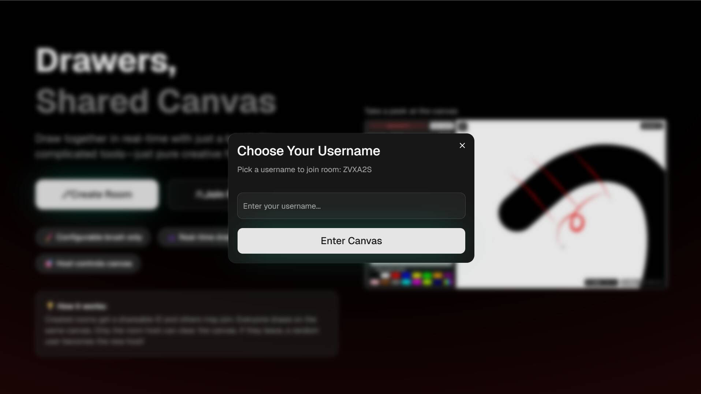

**This is the primary repository of the Drawers app.**

Related repositories:
  -  [drawers-backend](https://github.com/mrazbeno/drawers-backend)
  -  [drawers-shared](https://github.com/mrazbeno/drawers-shared)

# Drawers

A real-time collaborative drawing app with shareable rooms, configurable brush settings, and SVG-based rendering.

Built with Next.js, React, TypeScript, Socket.IO, Tailwind, Shadcn and the [Perfect freehand](https://github.com/steveruizok/perfect-freehand) stroke library.

## Demo

**Important:** The backend of the live demo is hosted on Render and may take a minute or two to spin up after inactivity.

A live demo is available [here](https://drawers-frontend.vercel.app/).

## Features

  - Real-time collaborative drawing via Socket.IO
  - Room-based collaboration with shareable room IDs
  - Basic role separation between host and guests
  - Configurable brush settings
  - SVG-based drawing
  - SVG export
  - Canvas zoom and pan

## Local setup

1. Clone **this** and the [drawers-backend](https://github.com/mrazbeno/drawers-backend) repositories.
      
2. In both projects: 
   - Install dependencies with `npm install`.
   - Copy `.env.local.example` to `.env.local`.
   - Adjust the local URLs as needed.
   - Start the development server with `npm run dev`.

3. Open `http://localhost:3010`, create a room, and copy the room ID..
4. Open the app in a separate tab or browsing session, then join the room with the copied ID.
5. Start drawing.

## Notes
  - This project is feature-complete and no longer actively developed.
  - Drawings are not persisted, but they can be exported directly as SVG.
  - If the backend server is offline, the app will show connection errors. This is expected in the live demo until the server wakes up.

## Screenshots & GIFs
A short GIF showing canvas view:

