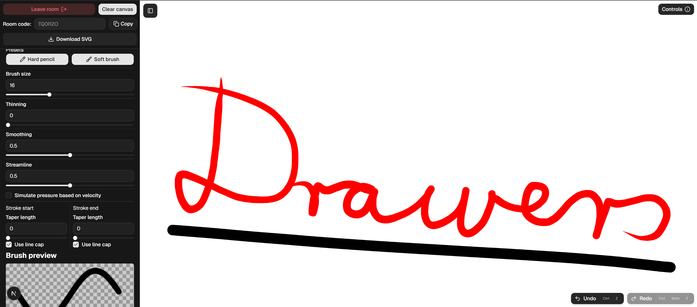
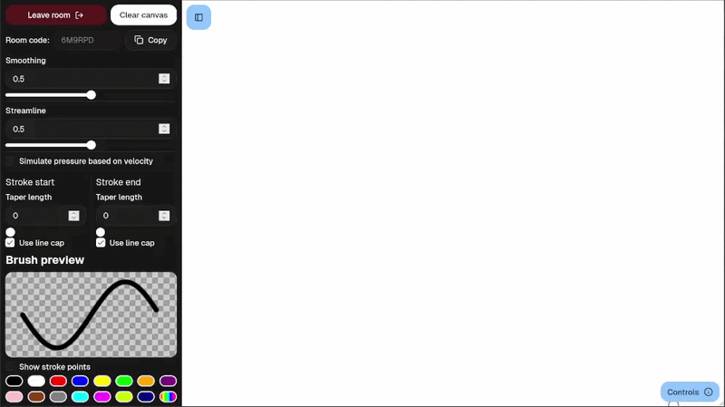
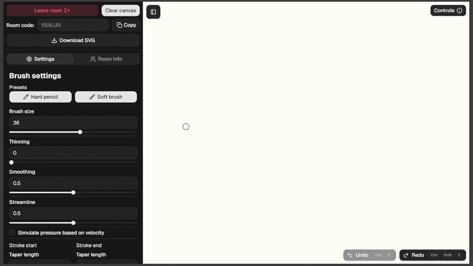
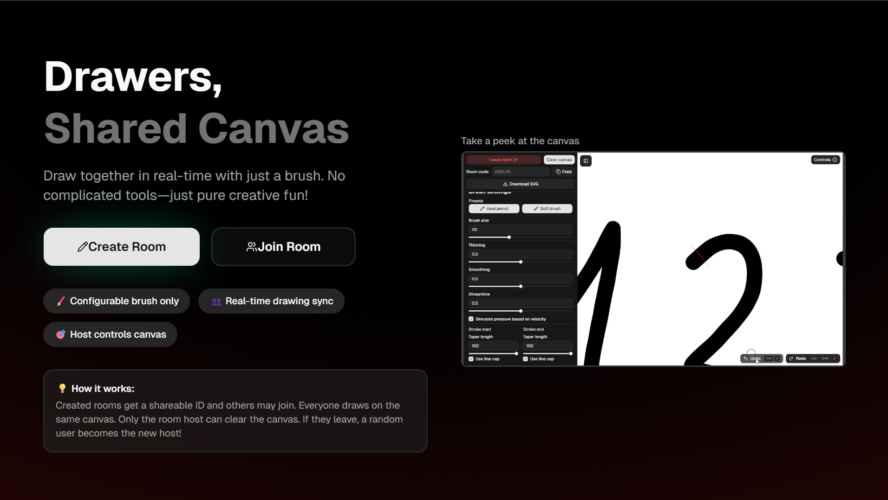
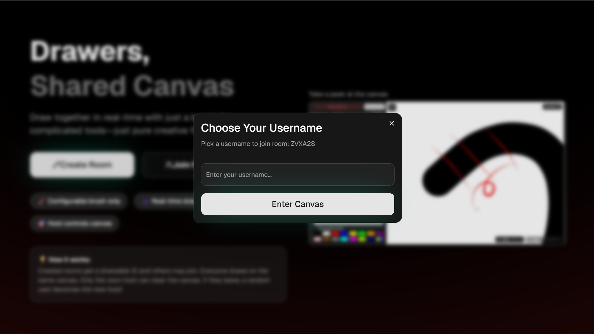

**This is the primary repository of the Drawers app.**

Other parts of this application are:
  -  [drawers-backend](https://github.com/mrazbeno/drawers-backend)
  -  [drawers-shared](https://github.com/mrazbeno/drawers-shared)

# Drawers

A collaborative drawing app showcasing real-time canvas, an adjustable brush tool and member rooms. 

Built with Next.js, React, TypeScript, Socket.IO, Tailwind, ShadCN and the [Perfect freehand](https://github.com/steveruizok/perfect-freehand) stroke library.

## Demo

**IMPORTANT:** The backend of the live demo is hosted on Render; it may take a minute or two to spin up after inactivity.

A live demo is available [here](https://drawers-frontend.vercel.app/).

## Features
- Real-time collaborative drawing via Socket.IO
- Rooms like partitioning of collaborating users
- Basic role separation (host and guests)
- Configurable brush
- SVG first drawing
- SVG export
- Canvas zoom & pan

## Local usage

1. Clone **this** and the [drawers-backend](https://github.com/mrazbeno/drawers-backend) repositories.
      
2. In both projects: 
   - Install packages with `npm install`.
   - Copy `.env.local.example` to create the `.env.local` file, and adjust URLs by preference.
   - Start the development server with `npm run dev`.

3. Open `http://localhost:3010`, create a room, copy the ID.
4. Open `http://localhost:3010` in another browser or incognito, join the room using the ID.
5. Start drawing!

## Notes
  - Considered feature-complete; no longer actively developed.
  - Drawings are not persisted, but direct SVG export is possible.
  - If server is offline, the app shows connection errors. (Noted in demo)

## Screenshots & GIFs
A short GIF showing canvas view:

